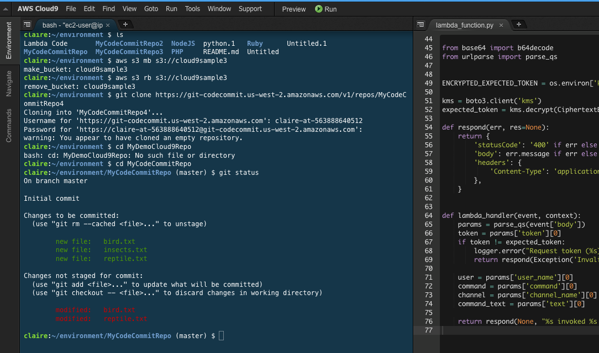

<!-- BEGIN_TF_DOCS -->


<p align="center">
    
</p>

# Cloud9 Multi-Environment Provisioning with Terraform


## Overview

This project provides a Terraform configuration to provision multiple AWS Cloud9 environments effortlessly. AWS Cloud9 is a cloud-based integrated development environment (IDE) that provides a convenient way to write, run, and debug code in various programming languages. With this Terraform setup, you can easily create and manage multiple Cloud9 environments for your development, testing, or collaborative needs.

<p align="center">
    
</p>

## Before starting

Be careful how you store your `tfstate` file as there will be passwords stored. It will not be displayed in the console as it is set as `sensitive` but still it will be there.

## Prerequisites

Before using this project, ensure you have the following prerequisites:

- An AWS account with the necessary permissions.
- AWS CLI configured on your local machine with access and secret keys.
- Terraform installed on your local machine. You can download it from [here](https://www.terraform.io/downloads.html).
- Basic familiarity with Terraform and AWS Cloud9.

## Getting Started

1. Clone this repository to your local machine.

```shell
git clone https://github.com/crispy-tk/aws-cloud9-multi-env.git
```

2. Change into the project directory.
```shell
cd aws-cloud9-multi-env
```

3. Create a `terraform.tfvars` file to customize your project. You can adjust parameters such as the `instance_type`, `members_list`, and more.

4. Initialize the Terraform configuration.
```shell
terraform init
```

5. Review the Terraform execution plan to ensure everything is as expected.
```shell
terraform plan
```

6. Apply the configuration to create your Cloud9 environments.
```shell
terraform apply
```

7. Confirm the execution by typing "yes" when prompted.

8. Terraform will create the Cloud9 environments according to your specifications.

## Cloud9 Configuration

To customize your Cloud9 environments, update the terraform.tfvars file with your desired configurations, including but not limited to:

* `region`: The region where the Cloud9 will be provisioned.
* `instance_type`: The EC2 instance type to use. 
* `project`: The name of your Cloud9 environment. It will be composed of the `project` parameter and a name from the `new_members` and `existing_members` parameter.
* `new_members`: A list of usernames to associate with the Cloud9 environment. The list of names will be used to create new IAM Users and assign to a Cloud IDE.
* `existing_members`: A list of exinting users to associate with the Cloud9 environment. The list of names will be used to assign to a Cloud IDE.

Example of Cloud9 environment naming.

```
myproject-username-{randomID}
```

You can refer to the AWS Cloud9 documentation for more configuration options.

## Examples

Example of `terraform.tfvars` file.

```hcl
project = "project-name"
profile = "yourawsprofile"
members_list = ["member01", "member02"]
```  

## Cloud9 Documentation
* [AWS Documentation - Cloud9 Language Support](https://docs.aws.amazon.com/cloud9/latest/user-guide/language-support.html)
* [AWS Documentation - Cloud9 Browsers](https://docs.aws.amazon.com/cloud9/latest/user-guide/browsers.html)

## How to Use

1. Run the following command in the Terminal to retrieve the users passwords.

```sh
$ terraform output password
```

2. Access the AWS Console using the brand new users and passwords.

3. Open the Cloud9 URL.

## Clean Up

When you no longer need a Cloud9 environment, you can destroy it with Terraform. Run the following command to destroy all the resources:
```shell
terraform destroy
```

## Directory Structure

```txt
.
├── docs
├── generate-readme.sh
├── images
│   ├── cloud9ui.png
│   └── tf_aws.png
├── LICENSE
├── main.tf
├── provider.tf
├── README.md
└── variables.tf

3 directories, 13 files
```

## Providers

| Name | Version |
|------|---------|
| <a name="provider_aws"></a> [aws](#provider\_aws) | 5.22.0 |
| <a name="provider_random"></a> [random](#provider\_random) | 3.5.1 |

## Inputs

| Name | Description | Type | Default | Required |
|------|-------------|------|---------|:--------:|
| <a name="input_existing_members"></a> [existing\_members](#input\_existing\_members) | Add existing users to membership. The number of members will determine the number of instances. | `list(string)` | n/a | yes |
| <a name="input_new_members"></a> [new\_members](#input\_new\_members) | Add new users to membership. The number of members will determine the number of instances. | `list(string)` | n/a | yes |
| <a name="input_instance_type"></a> [instance\_type](#input\_instance\_type) | Define instance type. | `string` | `"t2.micro"` | no |
| <a name="input_members_permissions"></a> [members\_permissions](#input\_members\_permissions) | Permissions are: `read-only` OR `read-write`. | `string` | `"read-write"` | no |
| <a name="input_profile"></a> [profile](#input\_profile) | Set your AWS CLI profile. | `string` | `"default"` | no |
| <a name="input_project"></a> [project](#input\_project) | Set your cloud9 project name. | `string` | `"example"` | no |
| <a name="input_region"></a> [region](#input\_region) | Define the provisioned region. | `string` | `"us-east-1"` | no |

## Outputs

| Name | Description |
|------|-------------|
| <a name="output_cloud9_url"></a> [cloud9\_url](#output\_cloud9\_url) | Return URL to access the environment |
| <a name="output_password"></a> [password](#output\_password) | Return user(s) profile(s) password(s) for console access. |

## Resources

| Name | Type |
|------|------|
| [aws_cloud9_environment_ec2.cloud9_instance](https://registry.terraform.io/providers/hashicorp/aws/5.22.0/docs/resources/cloud9_environment_ec2) | resource |
| [aws_cloud9_environment_membership.existing_user_membership](https://registry.terraform.io/providers/hashicorp/aws/5.22.0/docs/resources/cloud9_environment_membership) | resource |
| [aws_cloud9_environment_membership.new_user_membership](https://registry.terraform.io/providers/hashicorp/aws/5.22.0/docs/resources/cloud9_environment_membership) | resource |
| [aws_iam_user.new_user](https://registry.terraform.io/providers/hashicorp/aws/5.22.0/docs/resources/iam_user) | resource |
| [aws_iam_user_login_profile.profile](https://registry.terraform.io/providers/hashicorp/aws/5.22.0/docs/resources/iam_user_login_profile) | resource |
| [aws_iam_user_policy_attachment.policy_attach_existing](https://registry.terraform.io/providers/hashicorp/aws/5.22.0/docs/resources/iam_user_policy_attachment) | resource |
| [aws_iam_user_policy_attachment.policy_attach_new](https://registry.terraform.io/providers/hashicorp/aws/5.22.0/docs/resources/iam_user_policy_attachment) | resource |
| [random_id.env](https://registry.terraform.io/providers/hashicorp/random/3.5.1/docs/resources/id) | resource |
| [aws_iam_policy.cloud9](https://registry.terraform.io/providers/hashicorp/aws/5.22.0/docs/data-sources/iam_policy) | data source |
| [aws_iam_user.existing_user](https://registry.terraform.io/providers/hashicorp/aws/5.22.0/docs/data-sources/iam_user) | data source |

## Contributing

Contributions to this project are welcome. If you have any suggestions, bug fixes, or improvements, please open an issue in this repository.

## License

This project is licensed under the MIT License. See the LICENSE file for more details.
<!-- END_TF_DOCS -->